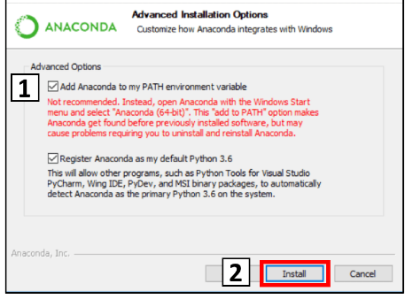

**Proje (11.11.2019)**  
 
Gönüllülük esasına göre Arduino ile proje yapabilirsiniz.  

Proje yapmanız durumunda başarı notunuz  
(%25 arasınav)+(%25 proje)+(%50 final sınavı),  
proje yapmazsanız   
(%50 arasınav)+(%50 final sınavı)   
şeklinde hesaplanacaktır.

**Proje:** Labirentten Çıkan Araç

Projeler tek kişi tarafından yapılacaktır.

Sadece, 1. ve 2. öğretimden 1'er kişi aracın labirentten ne kadar sürede çıktığını LCD veya 7 segment ile gösteren bir sistem geliştirecektir. Bu projeyi isteyenler ofisime gelip bildirebilir. İlk gelen projeyi alacaktır. Proje verildiğinde burada alındığı duyurulacaktır.

Yapmış olduğunuz projeyi yaklaşık 15 dakikalık bir video ile kullanılan bileşenler, yapım aşamaları ve kodlama-algoritmayı kapsayacak şekilde  anlatmanız gerekmektedir. 

Projede  yardım aldı iseniz veya kodlama için faydalandığınız kaynaklar var ise  ifade edilmelidir. Hazır setlerin kurulması şeklinde yapılan proje kabul edilmeyecektir. Proje kodlarını anlayıp anlamadığınız veya sizin yazıp yazmadığınızı anlamak için sunum esnasında   soru sorulacaktır.

Kodlarınız intihal programından geçirilecek eğer bir yerlerden birebir kopyala yapıştır yaptığınız anlaşılırsa projeniz değerlendirmeye alınmayacaktır. 

Aracı en kısa sürede labiretten çıkan, en yüksek puanı alacaktır. Aracın çıkış süresinin  artması  puanınızın azalması anlamına gelecektir.  Projeler bağıl olarak değerlendirilecektir.

Aracın labirentin duvarlarına çarpması, labirentten çıkamaması gibi durumlar eksi puan olarak değerlendirilecektir. 

Projede karşılaşılan problemlere özgün çözümleriniz ekstra puan almanıza sebep olabilir.

Proje başvuruları için son gün 21 Kasım Perşembedir.    
https://forms.gle/B881kGKAWRxXgRs28

Projelerin anlatıldığı Youtube'a yüklenen videolar, en son 10 Aralık Salı günü  daha sonra linki verilecek olan bir forma eklenecektir. Kodlamalar da en son bu tarihte gönderilecektir. Bu tarihte belirtilen dokümanları göndermeyenler  yarışmaya katılamayacaktır.

Tüm projeler 16 Aralık ders saatinde sunulacaktır.

İşyeri eğitiminde olanlar projelerini yukarıda belirtilen takvime göre hazırlayacaklardır. Final haftasının ilk gününde sunacaklardır. Saati sınav takvimi açıklandıktan sonra belirlenecektir.

Projenin başarılı bir şekilde çalışması sonrası puanlama:   
Sorular ve video 50 puan, proje 50 puan şeklinde puanlamaya tabi tutulacaktır.

---

**Python Programlama (11.11.2019)** 

Dersin 2. yarısında python programlama gösterilecektir. 

Python programlama dilinin popülaritesi aşağıdaki sitelerde raporlanmıştır:   
- https://www.tiobe.com/tiobe-index/
- http://pypl.github.io/PYPL.html

Python programlama için Anaconda dağıtımını kullanılabilir. Aşağıdaki sayfadan bigisayar işlemcisine göre 32-bit veya 64-bit 3.7 versiyonu indirilebilir.   
https://www.anaconda.com/distribution/

Programı yüklerken aşağıda gösterilen şeçimi yapınız:   

Python programlama için

- idle
- spyder
- jupyter
- vscode

editörleri/IDEleri kullanılabilir.

Ayrıca online programlama editörleri de mevcuttur.
- https://repl.it/languages/python3
- https://www.onlinegdb.com/online_python_compiler
- https://www.tutorialspoint.com/execute_python_online.php
- https://www.python.org/shell/ (komut satırı)
- https://pynative.com/online-python-code-editor-to-execute-python-code/

---

**Arasınav Sonuçları ve Kontrol (06.11.2019)**   
Arasınav notlarına [Arasınav](./arasinav/) klasöründen ulaşabilirsiniz.   
Sınav kağıtlarını 12.11.2019 Salı son gün olmak üzere kontrol edebilirsiniz.   

Sınav kağıdını kontrol için geldiğinizde **Ders Adı -> 1. veya 2. öğretim -> Yoklama Sıra No** bilgilerini söyleyiniz. 

*Yoklama sıra nosuna* notunuzu öğrendiğiniz dosyadan bakabilirsiniz.  

Kontrol için süre en fazla 10 dakikadır. Aynı anda birden fazla kişi kağıdını kontrol edemez. Dolayısıyla ofiste birileri var ise çıkmasını beklemeniz gerekiyor.

---

**Arasınav (03.11.2019)**     
- Sınav süresi 70 dakikadır.
- Sınavda 7 soru bulunmaktadır.
- Sınav, anlatılan tüm konuları büyük oranda içermektedir. Gerekli fonksiyonlar sınav kağıdında verilecektir. 
- Sınav kağıdına yoklama sıra numaranızı yazmanız gerekmektedir.
- Yoklama sıra numaralarına [Sınıf Listeler](./arasinav/sinif_listeler.txt) dosyasından bakabilirsiniz. Yoklama sıra numarasını yazmayanlar sınav kağıtlarını kontrol edemeyeceklerdir.
[Sınıf Listeler](./arasinav/sinif_listeler.txt) dosyasında da gösterildiği gibi
  - 1\. öğretim yoklama sıra numarası 1-40 olan öğrenciler 101 nolu sınıfta, 41-90 olan öğrenciler 104 nolu sınıfta,  91-138 olan öğrenciler 105 nolu sınıfta sınava girecektir. 
  - 2\. Öğretim yoklama sıra numarası 1-50 olan öğrenciler 1002 nolu sınıfta,   51-116 olan öğrenciler 1003 nolu sınıfta sınava girecektir.   
- Sınavdan önce sınıflara yoklama listesi asılacaktır. Bu yoklama listesi sınavda önünüze gelecek ve listede isminiz yok ise yoklamaya imza atmanız mümkün olmayacaktır.

---

**Arduino Kaynaklar:**   
- Simulasyon: https://www.tinkercad.com 
- Üye olduktan sonra: https://www.tinkercad.com/learn/circuits/learning
- https://www.arduino.cc/en/Tutorial/BuiltInExamples   
- Youtube &rarr; Arduino dersleri, Arduino tutorials, Tinkercad arduino uno dersleri

---

**Notlandırma**
- Dönem içi %50
  - Arasınav %100 veya Arasınav %50 + Proje %50 (Arasınavdan sonra 4 hafta içinde)
- Dönem Sonu %50

---

**İçerik**   
Dönem Başlangıcı - Arasınav: Arduino   
Arasınav - Dönem Sonu: Temel Python Programlama + Linux İşletim Sistemi+ Raspberry Pi GPIO

---

**İletişim**
Dr. Öğr. Üyesi Ali ŞENTÜRK   
eposta: alisenturk@isparta.edu.tr   
GitHub: github.com/asenturk/eem251   
Twitter: @asntrk

---

## Isparta Uygulamalı Bilimler Üniversitesi   
### Teknoloji Fakültesi Elektrik Elektronik Mühendisliği Bölümü   
#### 2019-2020 Güz Dönemi EEM251 İleri Düzey Programla Dersi   