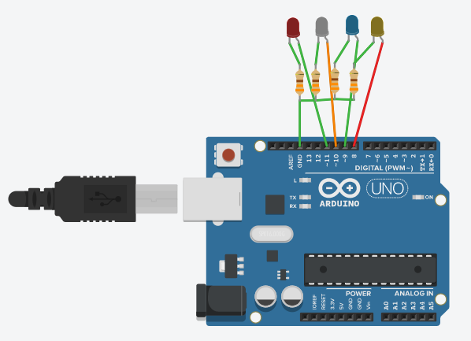
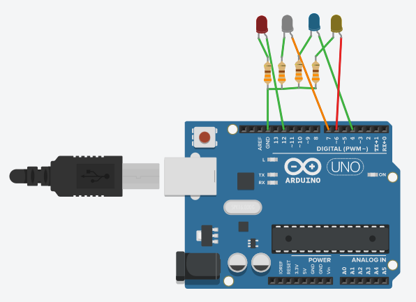
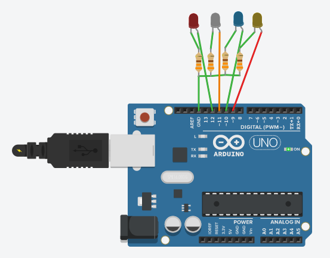

```c++
void setup() {
  pinMode(8, OUTPUT);
  pinMode(9, OUTPUT);
  pinMode(10, OUTPUT);
  pinMode(11, OUTPUT);
}

void loop() {
  digitalWrite(8, HIGH);
  digitalWrite(9, HIGH); 
  digitalWrite(10, HIGH); 
  digitalWrite(11, HIGH);    
  delay(200);                       
  digitalWrite(8, LOW); 
  digitalWrite(9, LOW); 
  digitalWrite(10, LOW); 
  digitalWrite(11, LOW);    
  delay(200);                       
}
```

---

```c++
void setup() {
  for(int pin=8; pin<=11; pin++)
    pinMode(pin, OUTPUT);
}

void loop() {
  int dly=500;
  for(int pin=8; pin<=11; pin++)
    digitalWrite(pin, HIGH);
  
  delay(dly);                       
  
  for(int pin=8; pin<=11; pin++)
    digitalWrite(pin, LOW); 
    
  delay(dly);                       
}
```

---

```c++
void setup() {
  for(int pin=8; pin<=11; pin++)
    pinMode(pin, OUTPUT);
}

void loop() {
  int dly=1000;
  
  for(int pin=8; pin<=11; pin++){
    digitalWrite(pin, HIGH);
    delay(dly);
    digitalWrite(pin, LOW);
    //delay(dly);
  }                      
}
```

---

```c++
void setup() {
  for(int pin=8; pin<=11; pin++)
    pinMode(pin, OUTPUT);
}

void loop() {
  int dly=1000;
  
  for(int pin=8; pin<=11; pin++){
    digitalWrite(pin, HIGH);
    delay(dly);
    digitalWrite(pin, LOW);
    //delay(dly);
  }
  
  for(int pin=10; pin>=9; pin--){
    digitalWrite(pin, HIGH);
    delay(dly);
    digitalWrite(pin, LOW);
    //delay(dly);
  }
 
```

---




```c++
int pinler[]={6,4,7,12};

void setup() {
  for(int i=0; i<=3; i++)
    pinMode(pinler[i], OUTPUT);
}

void loop() {
  int dly=500;
  
  for(int i=0; i<=3; i++){
    digitalWrite(pinler[i], HIGH);
    delay(dly);
    digitalWrite(pinler[i], LOW);
    delay(dly);
  }
                       
}
```

---

```c++
int pinler[]={6,4,7,12};

void setup() {
  for(int i=0; i<=3; i++)
    pinMode(pinler[i], OUTPUT);
}

void loop() {
  int dly;

  for(dly=400; dly>=100; dly-=50)
    for(int i=0; i<=3; i++){
      digitalWrite(pinler[i], HIGH);
      delay(dly);
      digitalWrite(pinler[i], LOW);
      delay(dly);
    }                       
}
```

---

```c++
int pinler[]={6,4,7,12};

void setup() {
  for(int i=0; i<=3; i++)
    pinMode(pinler[i], OUTPUT);
}
int dly=400;
void loop() {
    for(int i=0; i<=3; i++){
      digitalWrite(pinler[i], HIGH);
      delay(dly);
      digitalWrite(pinler[i], LOW);
      delay(dly);
    }

    dly-=50;
    if(dly==50)
      dly=400;
                       
}
```

---

```c++
int pinler[]={6,4,7,12};
long rastgele_sayi;

void setup() {
  for(int i=0; i<=3; i++)
    pinMode(pinler[i], OUTPUT);
  randomSeed(100);
}
int dly=400;
void loop() {
    for(int i=0; i<=3; i++){
      rastgele_sayi = random(0,4);
      digitalWrite(pinler[rastgele_sayi], HIGH);
      delay(dly);
      digitalWrite(pinler[rastgele_sayi], LOW);
      delay(dly);
    }   
                       
}
```
---




```c++
long rastgele_sayi;
void setup() {
  for(int i=9; i<=12; i++)
    pinMode(i, OUTPUT);
  randomSeed(100);
}
int dly=400;
void loop() { 
  rastgele_sayi = random(9,13);
  digitalWrite(rastgele_sayi, HIGH);
  delay(dly);
  digitalWrite(rastgele_sayi, LOW);
  delay(dly);                      
}
```

---


```c++
void setup() {
  for(int i=9; i<=12; i++)
    pinMode(i, OUTPUT);
}
int sayac=0;
int dly=500;
void loop() { 
  for(int i=0; i<=3; i++){
    if(bitRead(sayac, i)==1)
      digitalWrite(i+9, HIGH);
    else
      digitalWrite(i+9, LOW);
  }
  sayac++;
  delay(dly);
  if(sayac>15)
    sayac=0;
                
}
```

---


```c++
void setup() {
  for(int i=9; i<=12; i++)
    pinMode(i, OUTPUT);
}
int sayac=0;
int dly=500;
void loop() { 
  for(int i=0; i<=3; i++){
    if(bitRead(sayac, i))
      digitalWrite(i+9, HIGH);
    else
      digitalWrite(i+9, LOW);
  }
  sayac++;
  delay(dly);
                
}
```
