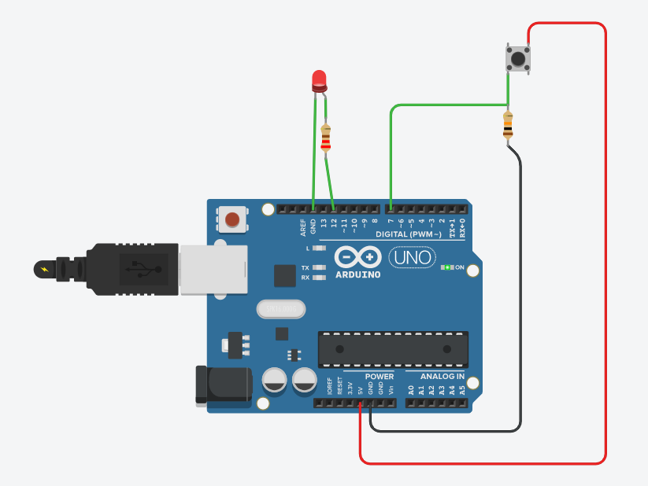
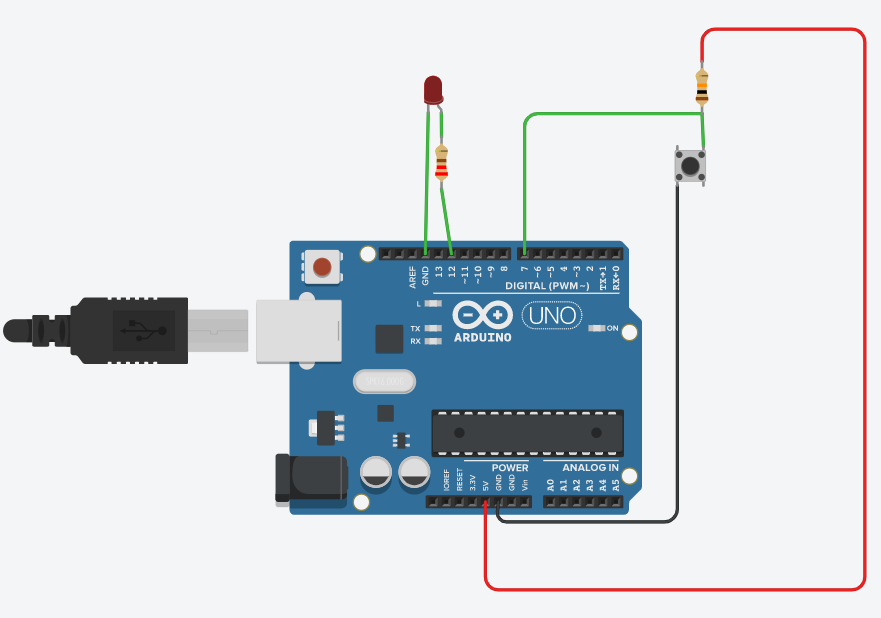
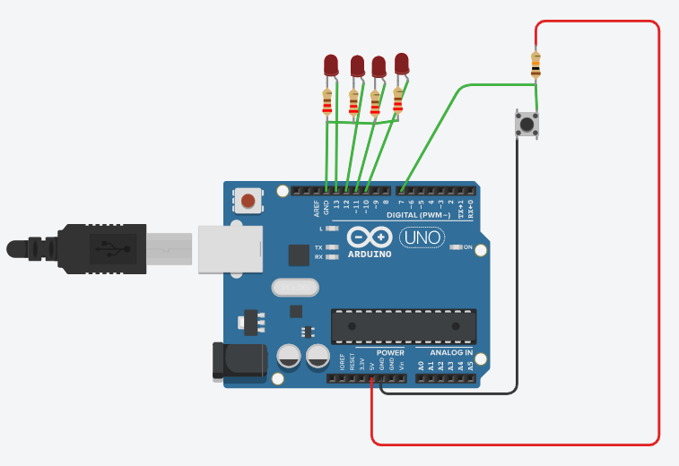
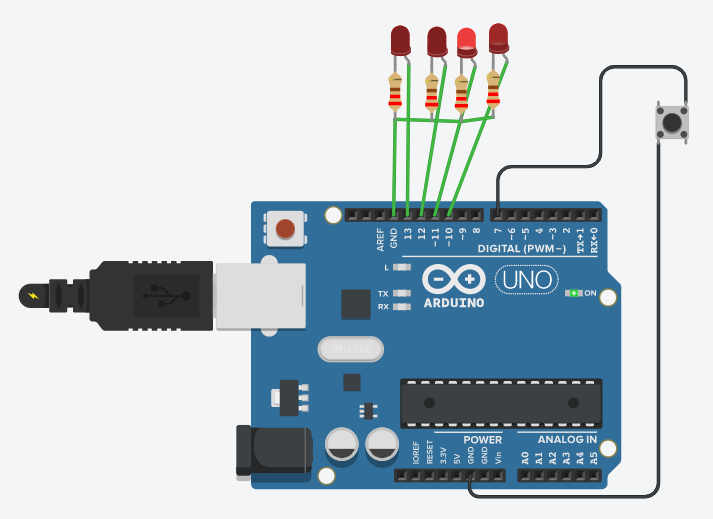
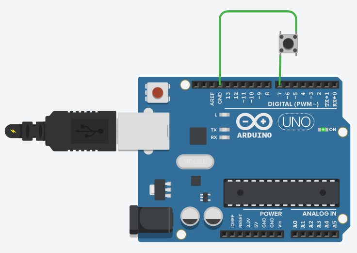

```c++
void setup() {
  pinMode(12, OUTPUT);
  pinMode(7, INPUT);
}

int buttonState;

void loop() {

  buttonState = digitalRead(7);

  if (buttonState == LOW) {
    digitalWrite(12, HIGH);
  } else {
    digitalWrite(12, LOW);
  }
}
```

---

Pull down direnci ile devre



---

Pull up direnci ile devre




---



```c++
int i;
void setup() {
  for(i=10;i<=13;i++)
    pinMode(i, OUTPUT);
  pinMode(7, INPUT);
}
void loop() {
  if (digitalRead(7)) {
    for(i=10;i<=13;i++){
      digitalWrite(i, HIGH);
      delay(300);
      digitalWrite(i, LOW);
    }
    
  } else {
      for(i=13;i>=10;i--){
        digitalWrite(i, HIGH);
        delay(300);
        digitalWrite(i, LOW);
    }
  }
}
```

```c++
int i;
int dly=1000;
void setup() {
  for(i=10;i<=13;i++)
    pinMode(i, OUTPUT);
  pinMode(7, INPUT);
}

int artis=120;
 
void loop() {
  if (digitalRead(7)==LOW) {
    dly = dly - artis;
  }
  if(dly<150 || dly>1000)
    artis = -1 * artis;

 
  
  for(i=10;i<=13;i++){
      digitalWrite(i, HIGH);
      delay(dly);
      digitalWrite(i, LOW);
    }
}
```

---



```c++
int i;
int dly=1000;
void setup() {
  for(i=10;i<=13;i++)
    pinMode(i, OUTPUT);
  pinMode(7, INPUT_PULLUP);
}

int artis=120;
 
void loop() {
  if (digitalRead(7)==LOW) {
    dly = dly - artis;
  }
  if(dly<150 || dly>1000)
    artis = -1 * artis;

 
  
  for(i=10;i<=13;i++){
      digitalWrite(i, HIGH);
      delay(dly);
      digitalWrite(i, LOW);
    }
}
```


---


```c++
int i;
int dly=1000;
void setup() {
  for(i=10;i<=13;i++)
    pinMode(i, OUTPUT);
    pinMode(3, INPUT_PULLUP);
    attachInterrupt(digitalPinToInterrupt(3), dly_degistir, FALLING);
}
int artis=120;
void loop() {
  for(i=10;i<=13;i++){
      digitalWrite(i, HIGH);
      delay(dly);
      digitalWrite(i, LOW);
    }
}
void dly_degistir(){
    dly = dly - artis;
  if(dly<150 || dly>1000)
    artis = -1 * artis;
}
```


---



```c++
void setup() {
  pinMode(13, OUTPUT);
  pinMode(7, INPUT_PULLUP);
}

int yuksek_dusuk = LOW;             
unsigned long onceki = 0;         

void loop() {
  unsigned long simdi = millis();
  if (simdi - onceki >= 1000) {
    onceki = simdi;
    if (yuksek_dusuk == LOW) 
      yuksek_dusuk = HIGH;
     else 
      yuksek_dusuk = LOW; 
	
	digitalWrite(13, yuksek_dusuk);
  }
}
```


```c++
void setup() {
  pinMode(13, OUTPUT);
  pinMode(7, INPUT_PULLUP);
}

int yuksek_dusuk = LOW;             
unsigned long onceki = 0;         

void loop() {
  unsigned long simdi = millis();
  if (simdi - onceki >= 1000) {
    onceki = simdi;
    if (yuksek_dusuk == LOW) 
      yuksek_dusuk = HIGH;
     else 
      yuksek_dusuk = LOW;
  }
  if (digitalRead(7)==LOW)
    digitalWrite(13, yuksek_dusuk);
  else
    digitalWrite(13, LOW);
}
```

