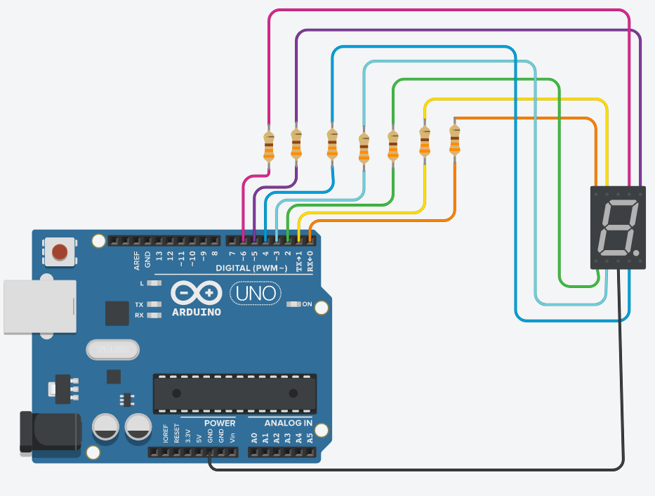
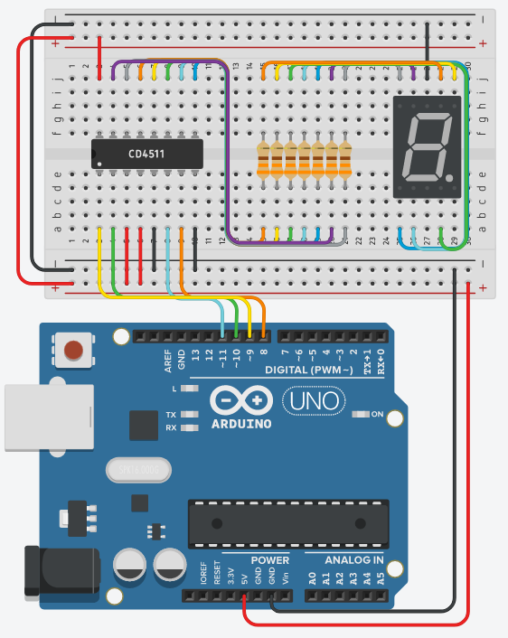
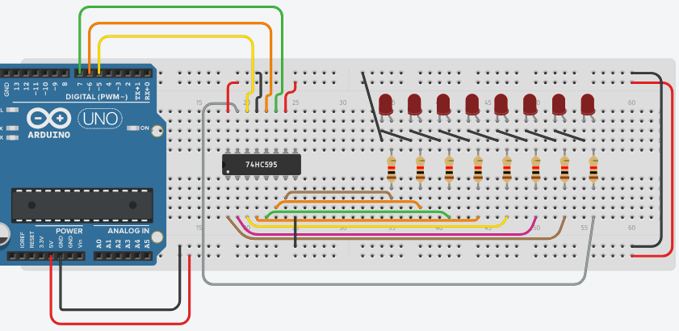
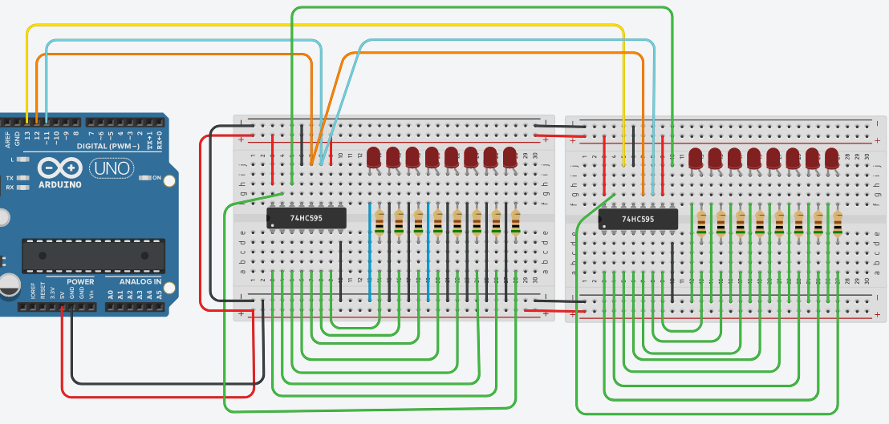

Butona her basıldığında Ledi yanık ise söndüren sönük ise yakan program. Bounce'dan dolayı oluşan her 1'den 0'a ve 0'dan 1'e geçiş algılınıp en son değişimden itibaren 50 ms geçmiş ise bu durum kabul ediliyor.


```c++
int ledState = HIGH;        
int buttonState=LOW;            
int lastButtonState = LOW;  

unsigned long lastDebounceTime = 0;  
unsigned long debounceDelay = 50;    

void setup() {
  pinMode(2, INPUT);
  pinMode(13, OUTPUT);
  digitalWrite(13, ledState);
}

void loop() {
  int reading = digitalRead(2);
  // değişim var ise debounce timerı güncelle
  if (reading != lastButtonState) {
    
    lastDebounceTime = millis();
  }

//Eğer son değişimin üzerinden 50ms geçmişse buton durumunu okunan değerle güncelle. buton durumu HIGH ise ledin durumunu değiştir. 
  if ((millis() - lastDebounceTime) > debounceDelay) {


    // if the button state has changed:
    if (reading != buttonState) {
      buttonState = reading;

      // only toggle the LED if the new button state is HIGH
      if (buttonState == HIGH) {
        ledState = !ledState;
      }
    }
  }

  digitalWrite(13, ledState);

  lastButtonState = reading;
}
```

---




```c++
int sayilar[]={126, 48, 109, 121, 51, 91, 95, 112, 127, 123};
int sayac=0;

void setup(){
  for(int i=0;i<7;i++)
    pinMode(i, OUTPUT);
}

void loop(){
  for(int i=0;i<7;i++){
    if(bitRead(sayilar[sayac],i))
      digitalWrite(i, HIGH);
    else
      digitalWrite(i, LOW);
  }
    sayac++;
    delay(1000); 

    if(sayac==10)
      sayac=0;
}
```

---
Kaynak: https://www.ti.com/lit/ds/symlink/cd4511b.pdf




```c++
int sayac=0;
void setup()
{
  for(int i=8;i<=11;i++)
    pinMode(i, OUTPUT);
}

void loop()
{
  for(int i=0;i<4;i++)
   digitalWrite(i+8,bitRead(sayac,i));
    
  sayac++;
  delay(1000); 

  if(sayac==10)
    sayac=0;
}
```

---

Kaynak:
- https://www.onsemi.com/pub/Collateral/MC74HC595-D.PDF

- http://diyot.net/74hc595/




```c++
int latchPin = 6;
int clockPin = 7;
int dataPin = 5;
int i=0;
 
void setup() 
{
  pinMode(latchPin, OUTPUT);
  pinMode(dataPin, OUTPUT);  
  pinMode(clockPin, OUTPUT);
}
 
void loop() 
{ 
   digitalWrite(latchPin, LOW);
   shiftOut(dataPin, clockPin, MSBFIRST, i);
   digitalWrite(latchPin, HIGH);
  delay(700);
  i++;
}
```

---




```c++
int latchPin = 12;  
int clockPin = 11;		 
int dataPin = 13;	 

byte high = 0;
byte low = 0;

unsigned long i = 1;

void setup(){    
    pinMode(latchPin, OUTPUT);
    pinMode(dataPin, OUTPUT);
    pinMode(clockPin, OUTPUT);
}

void loop(){
    low = i;
    high = i >> 8;

    digitalWrite(latchPin, LOW);
    shiftOut(dataPin,clockPin, MSBFIRST, high);
    shiftOut(dataPin,clockPin, MSBFIRST, low);
    
    digitalWrite(latchPin, HIGH);
  
    i = i << 1;
  	if(i > 32768 )
      i=1;

    delay(500);
}
```


