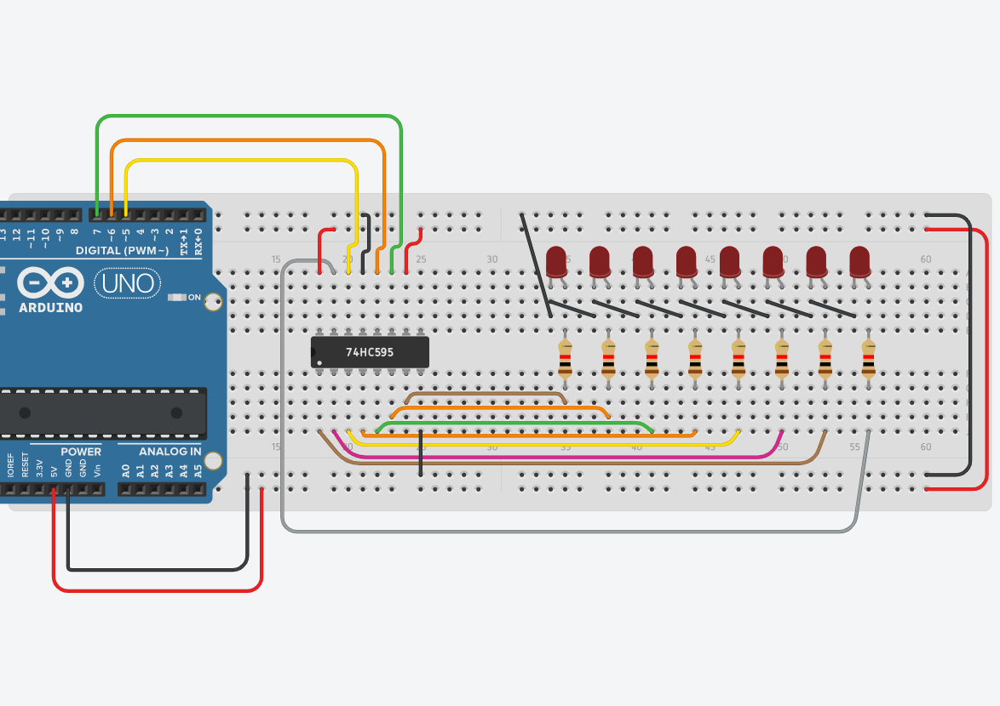
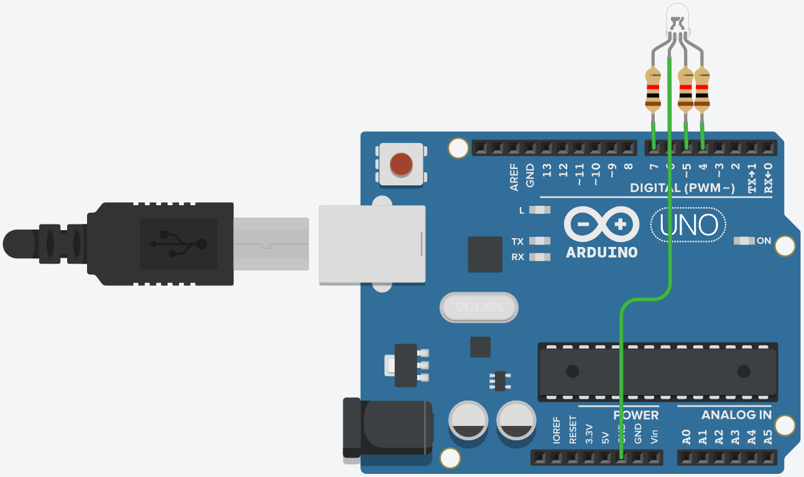
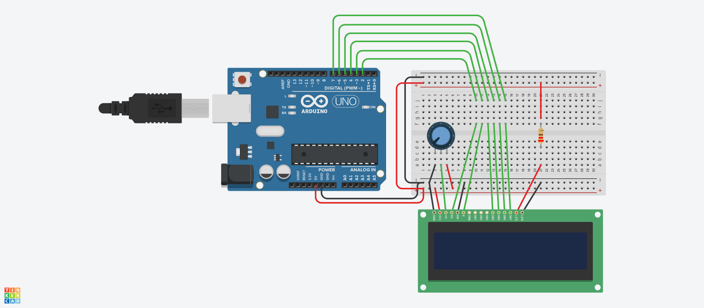
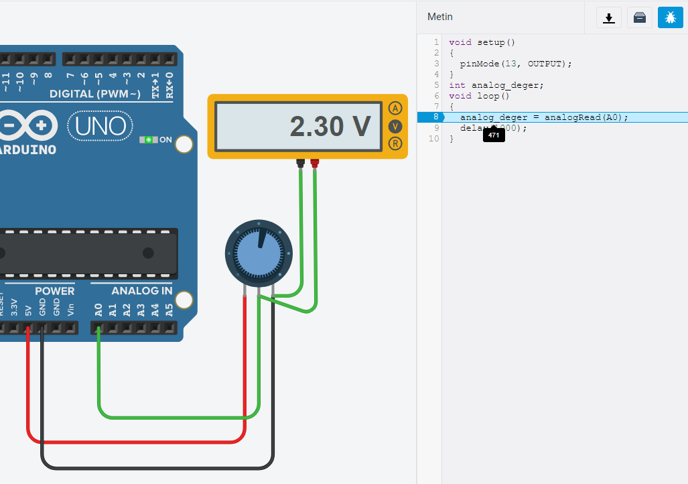
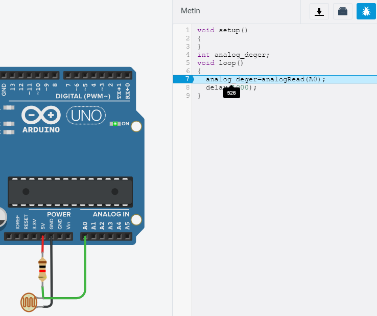

Fonksiyon kullanmadan shift register (kaydırma yazmacı) kullanma.

```c++
int cikis_clk = 6;
int kaydirma_clk = 7;
int dataPin = 5;
int i=0;
 
void setup() 
{
  pinMode(cikis_clk, OUTPUT);
  pinMode(dataPin, OUTPUT);  
  pinMode(kaydirma_clk, OUTPUT);
}
 int veri=100;
 int basamak;
void loop() 
{ 
  digitalWrite(cikis_clk, LOW);
  for(i=7;i>=0;i--){
    
    digitalWrite(kaydirma_clk, LOW);  
    basamak=bitRead(veri,i);
    digitalWrite(dataPin, basamak);
    digitalWrite(kaydirma_clk, HIGH);
  }  
  digitalWrite(cikis_clk, HIGH);
  delay(1000);
}
```

Kaydırma işleminin nasıl yapıldığı gözlenebilir.
```c++
int cikis_clk = 6;
int kaydirma_clk = 7;
int dataPin = 5;
int i=0;
 
void setup() 
{
  pinMode(cikis_clk, OUTPUT);
  pinMode(dataPin, OUTPUT);  
  pinMode(kaydirma_clk, OUTPUT);
}
 int veri=100;
 int basamak;
void loop() 
{ 
  
  for(i=7;i>=0;i--){
    digitalWrite(cikis_clk, LOW);
    digitalWrite(kaydirma_clk, LOW);  
    basamak=bitRead(veri,i);
    digitalWrite(dataPin, basamak);
    digitalWrite(kaydirma_clk, HIGH);
    digitalWrite(cikis_clk, HIGH);
    delay(1000);
  }  
}
```


---

RGB ledin 8 farklı durumunu gözlemleme.



```c++
int pinler[]={4,5,7};
void setup() {
  for(int i=0;i<3;i++)
    pinMode(pinler[i], OUTPUT);
}
int sayac=0;
int okunan_bit;
void loop() {
  for(int i=0;i<3;i++){
    okunan_bit=bitRead(sayac,i);
    digitalWrite(pinler[i], okunan_bit); 
  }
  delay(1000);
  sayac++;
}
```

---

LCD display şablon dosyası, Merhaba dünya yazdırma ve alt satırda saniye göstergesi



```c++
/*
  LiquidCrystal Library - Hello World

 Demonstrates the use a 16x2 LCD display.  The LiquidCrystal
 library works with all LCD displays that are compatible with the
 Hitachi HD44780 driver. There are many of them out there, and you
 can usually tell them by the 16-pin interface.

 This sketch prints "Hello World!" to the LCD
 and shows the time.

  The circuit:
 * LCD RS pin to digital pin 12
 * LCD Enable pin to digital pin 11
 * LCD D4 pin to digital pin 5
 * LCD D5 pin to digital pin 4
 * LCD D6 pin to digital pin 3
 * LCD D7 pin to digital pin 2
 * LCD R/W pin to ground
 * LCD VSS pin to ground
 * LCD VCC pin to 5V
 * 10K resistor:
 * ends to +5V and ground
 * wiper to LCD VO pin (pin 3)

 Library originally added 18 Apr 2008
 by David A. Mellis
 library modified 5 Jul 2009
 by Limor Fried (http://www.ladyada.net)
 example added 9 Jul 2009
 by Tom Igoe
 modified 22 Nov 2010
 by Tom Igoe

 This example code is in the public domain.

 http://www.arduino.cc/en/Tutorial/LiquidCrystal
 */

// include the library code:
#include <LiquidCrystal.h>

// initialize the library with the numbers of the interface pins
LiquidCrystal lcd(2, 3, 4, 5, 6, 7);

void setup() {
  // set up the LCD's number of columns and rows:
  lcd.begin(16, 2);
  // Print a message to the LCD.
  lcd.print("hello, world!");
}

void loop() {
  // set the cursor to column 0, line 1
  // (note: line 1 is the second row, since counting begins with 0):
  lcd.setCursor(0, 1);
  // print the number of seconds since reset:
  lcd.print(millis() / 1000);
  delay(100);
}
```

0-999 arası sayıların LCD ye yazıdırılması.   
Üstte X. YUZ altta ise onlar-birler basamağı yazacak.

```c++
#include <LiquidCrystal.h>
LiquidCrystal lcd(2, 3, 4, 5, 6, 7);

void setup() {
  
  lcd.begin(16, 2);
}
int i=0;
int yuz;
void loop() {
  yuz=i/100;
  lcd.setCursor(0, 0);
  lcd.print(yuz);
  lcd.setCursor(1, 0);
  lcd.print(". YUZ:");
  
  lcd.setCursor(7, 1);
  lcd.print(i % 100);
  i++;
  delay(100);

  if(i==1000)
    i=0; 
}
```

Butona basılmasını sayan program.

```c++
#include <LiquidCrystal.h>

// initialize the library with the numbers of the interface pins
LiquidCrystal lcd(2, 3, 4, 5, 6, 7);

void setup() {
  pinMode(9, INPUT_PULLUP);
  lcd.begin(16, 2);
  lcd.print("BUTON SAYACI:");
}

int sayac=0;

unsigned long onceki=0;
void loop() {
  lcd.setCursor(0, 1);
  
  if(digitalRead(9)==LOW && millis()-onceki>500){
    sayac++;
    onceki=millis();
  }
  
  lcd.print(sayac);
  delay(100);

}
```
---
Potansiyometreden analog değer okumak. Bu program debug modunda çalıştırılarak okunan değer gözlenmiştir.



```c++
void setup()
{
  pinMode(13, OUTPUT);
}
int analog_deger;
void loop()
{
  analog_deger = analogRead(A0);
  delay(1000);
}
```

---

LDR'den analog değer okumak. Bu program debug modunda çalıştırılarak okunan değer gözlenmiştir.




```c++
void setup()
{
}
int analog_deger;
void loop()
{
  analog_deger=analogRead(A0);
  delay(1000);
}
```


