Sıcaklık sensörünü kullanarak ortamın sıcaklığını LCD ekrana yazdırma.   
Bu işlem için, sensörün 0 derecede 500 mV, 50 derecede 1000 mV değer ürettiği gözlendi. Bu voltaj değerleri 10 bit ADC'de 102 ve 204 değerlerine karşılık geldiği hesaplandı.

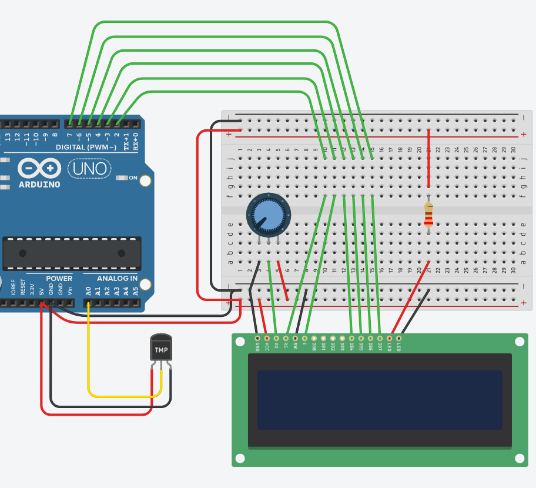

```c++
// include the library code:
#include <LiquidCrystal.h>

// initialize the library with the numbers of the interface pins
LiquidCrystal lcd(2, 3, 4, 5, 6, 7);

void setup() {
  // set up the LCD's number of columns and rows:
  lcd.begin(16, 2);
  
}

int analog_deger;
int derece;
void loop() {
  analog_deger=analogRead(A0);
  derece=map(analog_deger, 102, 204, 0, 50);
  lcd.clear();
  lcd.print("Sicaklik:");
  lcd.setCursor(0, 1);
  lcd.print(derece);

  delay(100);
}
 
```

---


analogWrite fonksiyonu ile PWM sinyali:

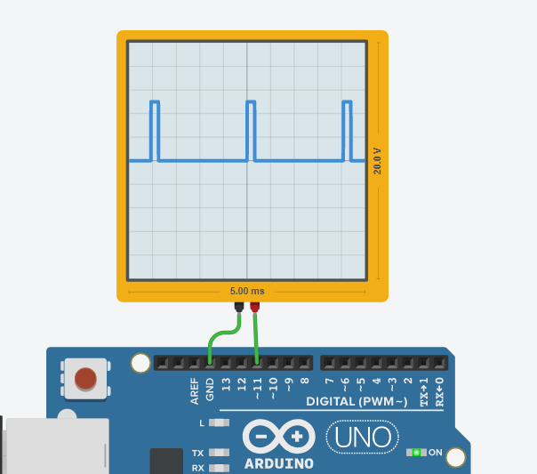   

   


```c++
void setup()
{ 
  pinMode(11, OUTPUT);
}
void loop()
{
  analogWrite(11, 20);
  delay(10000);
  analogWrite(11, 200);
  delay(10000); 
}
```

---

Bir ledin parlaklığını kademeli bir şekilde arttırma ve azaltma:

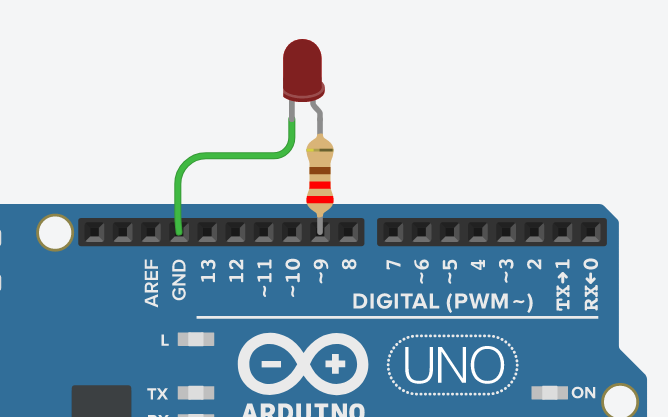

```c++
void setup()
{
  pinMode(9, OUTPUT);
}
int parlaklik;
void loop()
{
  for(parlaklik=20;parlaklik<230;parlaklik=parlaklik+10){
    analogWrite(9,parlaklik);
    delay(40); 
  }
  for(parlaklik=230;parlaklik>20;parlaklik=parlaklik-10){
    analogWrite(9,parlaklik);
    delay(40); 
  }
}
```

---
Transistör ile Motor sürme. aalogWrite fonksiyonuna yazılan parametrenin değiştirilmesi ile motorun dönüş hızı değişecektir.

(Pratikte  motorun - ucundan + ucuna diyot bağlamak gerekir!)

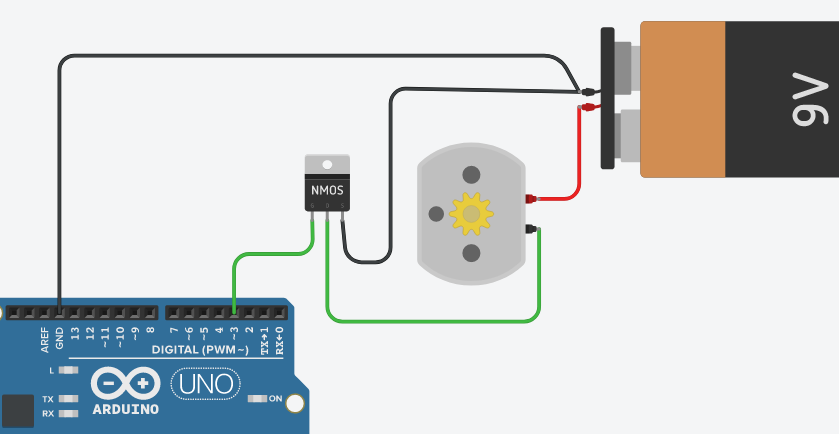

```c++
void setup()
{
  pinMode(3, OUTPUT);
}

void loop()
{
  analogWrite(3,200);
  delay(1000); // Wait for 1000 millisecond(s)
}
```

---

H Köprüsü:
Motorun yönü H köprüsü ile değiştirilebilir.

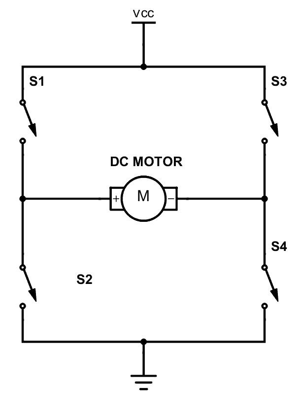
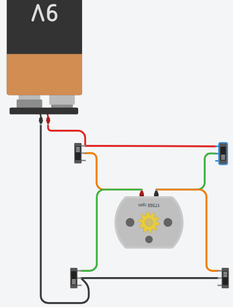
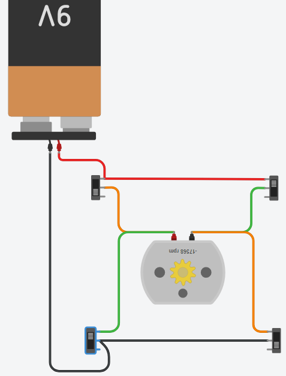

---
L293D Entegresi ile 2 tane motor sürülebilir. PWM sinyali ile motorların hızları ayarlanabilir ve yönleri de değiştirilebilir.

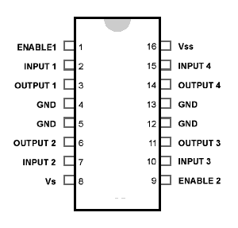
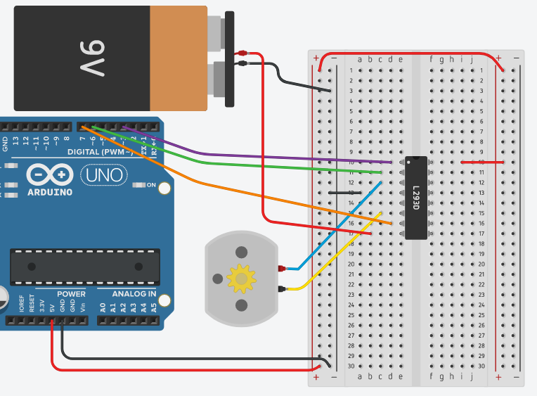

```c++
void setup()
{
  pinMode(7, OUTPUT); // giris
  pinMode(6, OUTPUT); // giris
  pinMode(3, OUTPUT); // etkinlestirme
  digitalWrite(3, HIGH);
}
int i=255;
void loop()
{
  digitalWrite(7, HIGH);
  digitalWrite(6, LOW);
  delay(2000);
  digitalWrite(7, LOW);
  digitalWrite(6, HIGH);
  delay(2000);
  analogWrite(3,i);
  if(i>50)
    i=i-10;
}
```


---

Servo Motor:

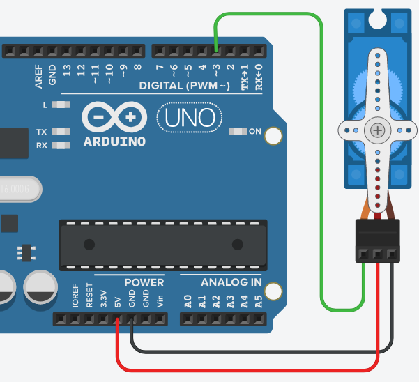

```c++
#include <Servo.h> 
Servo myservo;
void setup() 
{ 
  myservo.attach(3);
} 
void loop() {
  for(int aci=0;aci<=180;aci=aci+30){  
    myservo.write(aci);
    if(aci==0)
      delay(500);
    delay(1000);
  }
} 
```

---
Seri Haberleşme:

Aşağıdaki kodlama ile bilgisayara deneme\n ifadesi gönderilmektedir.
```c++
void setup() {
  Serial.begin(9600);
}
void loop() {
  Serial.println("deneme");
  delay(1000);
}
```

Gönderilen karakterleri Lojik analizörü ile gözlemlemek için program şu şekle dönüştürülmüştür:

```c++
void setup() {
  Serial.begin(9600);
}
void loop() {
  Serial.print("d");
  delay(10);
  Serial.print("e");
  delay(10);
  Serial.print("n");
  delay(10);
  Serial.print("e");
  delay(10);
  Serial.print("m");
  delay(10);
  Serial.print("e");
  delay(10); 
}
```

d, e ve n harfleri aşağıdaki şekilde bilgisayara gönderilmiştir:

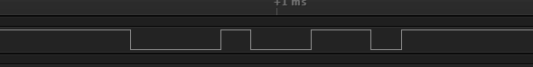
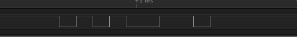
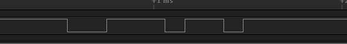


